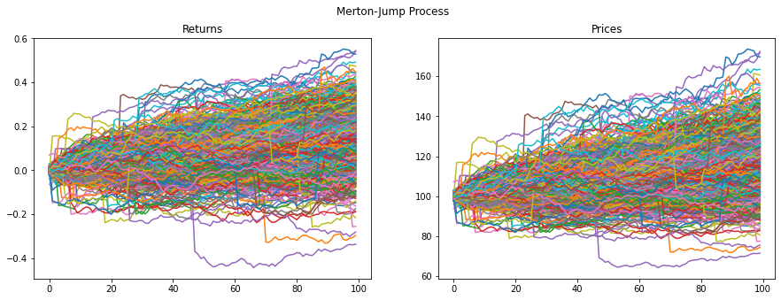

# Stochastic process
Python module to simulate prices and rates under different stochastic processes

## Examples

### Geometric Brownian Motion

  

### Variance Gamma Process

  

### Merton Jump Process

  

### Ornstein-Uhlenbeck process

  

### Cox-Ingersoll-Ross Process

  

